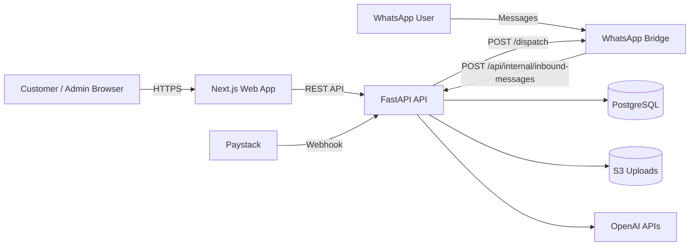
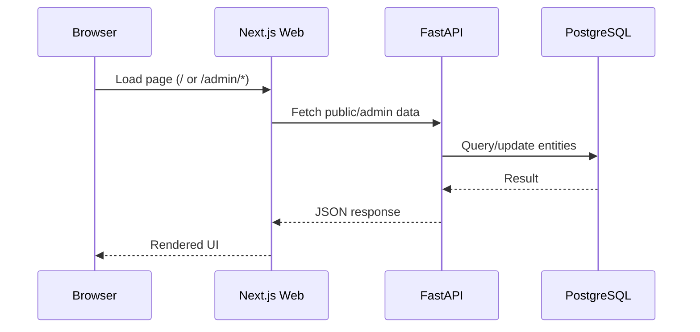
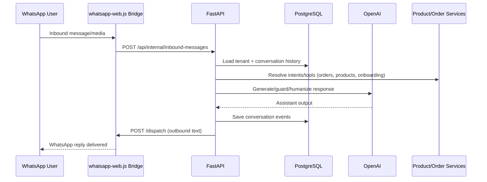
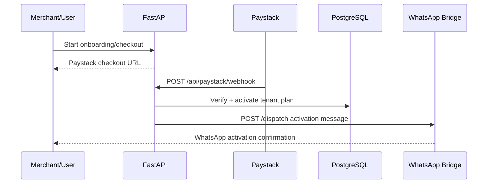

# Whatcommerce Architecture

This document explains how the application works at runtime.

## High-level system

## Request and message flow

### 1) Public/admin web flow

### 2) WhatsApp inbound -> AI/tools -> outbound

### 3) Billing activation flow

## Core backend modules

- `api/app/api/routes`: HTTP entry points (public, admin, internal, webhook, files)
- `api/app/services`: business logic (onboarding, bridge status, store manager, knowledge, payment)
- `api/app/models`: SQLAlchemy entities
- `api/alembic`: DB migrations
- `whatsapp/whatcommerce/index.mjs`: WhatsApp bridge runtime
- `web/src/app` + `web/src/components`: landing and admin UI

## Storage model

- Primary transactional data: PostgreSQL
- Product/media uploads: local in dev, S3 in deployed environments
- WhatsApp session runtime cache: bridge local `.wwebjs` (not committed)

## Security boundaries

- Admin APIs require JWT bearer auth
- Internal APIs require `X-Internal-Key`
- CORS controlled by `CORS_ORIGINS`
- Cloud resources and env secrets managed through IAM + Secrets Manager in deployed envs
