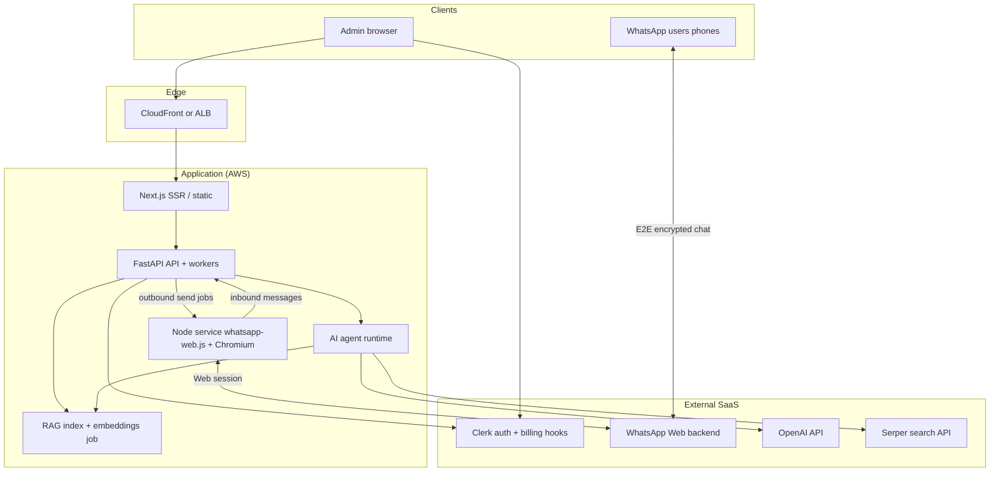
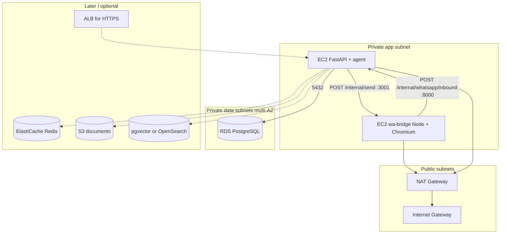
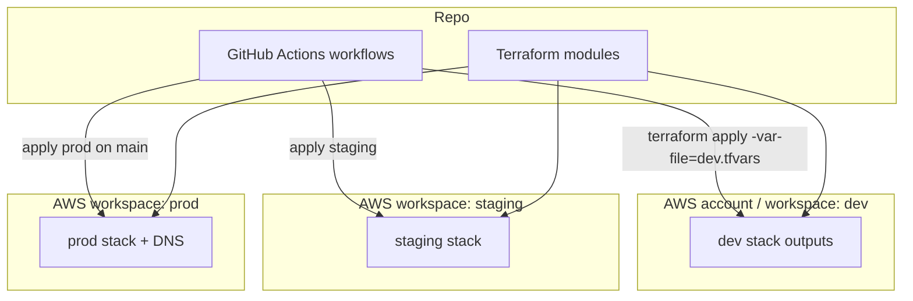
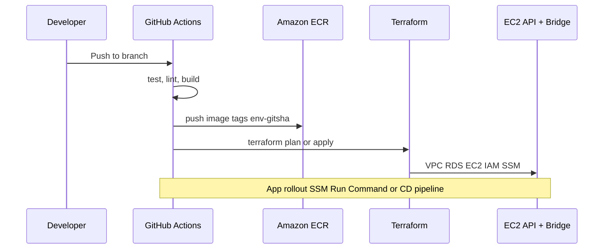
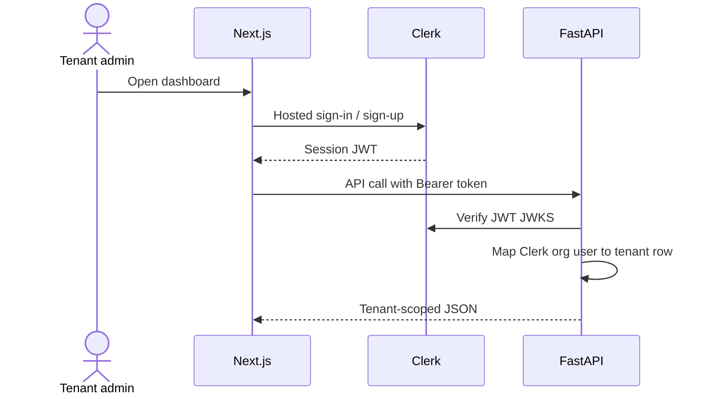
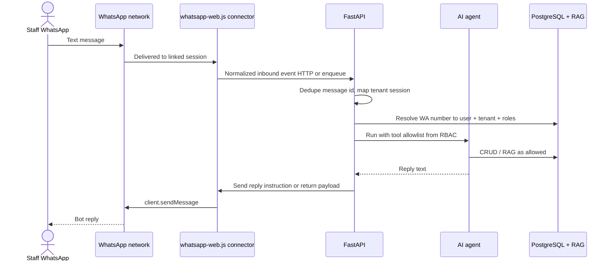
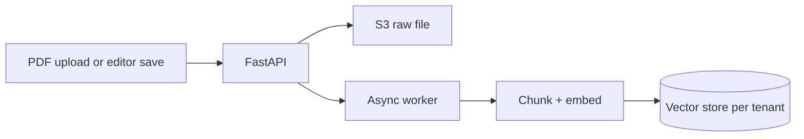

# Whatcommerce — System architecture

This document describes the major services, how they connect, deployment strategy aligned with Terraform and GitHub Actions, and the main user flows. It complements **`Planning.md`**.

---

## 1. High-level system context

Whatscommerce splits **control-plane** traffic (browser → Next.js + Clerk + FastAPI) from **messaging-plane** traffic (WhatsApp’s servers ↔ a long-lived **whatsapp-web.js** client). There is **no Meta WhatsApp Cloud API**: pairing, inbound events, and sends all go through the **Web** protocol client you host. Both planes talk to the same **tenant-scoped** data and **subscription** state.

**Process split:** the **Node** service only runs **WhatsApp Web** (`whatsapp-web.js` + Chromium). **FastAPI** hosts the **public REST API**, business logic, persistence, and the **AI agent** (tool calls, RAG, OpenAI). The two **always communicate**: Node forwards inbound chats to FastAPI; FastAPI (after the agent runs) tells Node what to **send** on WhatsApp (HTTP callback, internal queue, or shared Redis pub/sub—pick one pattern and secure it).



### Service responsibilities

| Component | Role |
|-----------|------|
| **Next.js** | Admin UI, server components / BFF calls to FastAPI, Clerk session integration. |
| **Clerk** | Authentication for the web app, organisation/user identity, subscription state or Stripe customer linkage. |
| **FastAPI** | REST (and optional WebSocket) API: tenants, RBAC, products, orders, documents, WhatsApp user mapping, job enqueueing, **PostgreSQL (RDS)** persistence, and **inbound message handling** from the WA connector (not Meta webhooks). |
| **AI agent runtime** | Can live inside FastAPI workers or separate worker service: resolves WhatsApp sender → user/customer, loads allowed tools, calls OpenAI with RAG context. |
| **RAG** | Ingest PDFs and editor content → chunk → embed → vector store per tenant; query at answer time. |
| **whatsapp-web.js service (Node)** | Long-lived client: **QR pairing** (exposed to dashboard via WebSocket/SSE or signed URL), Chromium/Puppeteer session to WhatsApp Web, `message` / `message_create` listeners, **`sendMessage` driven by instructions from FastAPI**. Forwards normalized inbound events to FastAPI; receives outbound payloads or jobs from FastAPI (same transport you choose: HTTP, queue, or pub/sub). |
| **OpenAI** | Chat / tool orchestration for the agent. |
| **Serper** | Optional web search tool for the agent. |
| **Playwright (MCP)** | Optional; isolate in a sandboxed runner with strict policies if enabled. |

---

## 2. Logical architecture (inside the VPC)

**Current target layout:** **two separate EC2 instances** in a **private application subnet**, plus **Amazon RDS for PostgreSQL** in **private database subnets**, outbound via **NAT** (no Meta Cloud API). A future **internal or public ALB** can sit in front of FastAPI when the Next.js admin and public HTTPS need a stable entry point.



- **EC2 (FastAPI)**: Private IP only; security group allows **TCP 8000 from the bridge SG**; connects to **RDS** on 5432; reaches the internet via **NAT** (OpenAI, package updates, AWS APIs).
- **EC2 (wa-bridge)**: Private IP only; SG allows **TCP 3001 from the API SG**; same NAT egress for WhatsApp Web and Chromium updates.
- **Fixed private IPs** (implemented in `terraform/`): avoids bootstrap chicken-and-egg for `API_BASE_URL` / `BRIDGE_BASE_URL` between the two hosts.
- **PostgreSQL (RDS)**: System of record for users, tenants, RBAC, products, orders, audit logs, WhatsApp phone → user mapping, handoff state. Terraform stores credentials in **Secrets Manager**; first-boot `user_data` on the API host can assemble `DATABASE_URL`.
- **Redis**: Not provisioned yet—queues, rate limits, **idempotency keys for inbound WhatsApp message IDs**, optional pub/sub between bridge and API.
- **S3 / vector**: Same as architecture doc above when you add RAG and documents.

IaC for this baseline lives under **`terraform/`** (VPC, NAT, RDS, security groups, IAM for **SSM Session Manager**, SSM parameter for **internal** API↔bridge secret, two EC2 instances).

---

## 3. Deployment strategy (Terraform + GitHub Actions)

Goal: **repeatable environments** (`dev`, `staging`, `prod`) with **prod** mapping to **`whatcommerce.ifedayo.dev`**.



### Practices

1. **One Terraform codebase**, multiple **workspaces** or **var-files** (`dev.tfvars`, `staging.tfvars`, `prod.tfvars`) controlling instance sizes, deletion protection, and DNS.
2. **GitHub Actions**:
   - **Pull requests**: `terraform plan` only (read-only AWS role).
   - **Merge to `main`**: plan + apply **staging** (optional) then **prod** with manual approval gate if you want extra safety.
   - **Ephemeral dev**: workflow_dispatch or label-triggered apply using a small footprint; `terraform destroy` job for teardown.
3. **Application delivery on EC2**: Build **FastAPI** and **wa-bridge** images in CI, push to **ECR**, then deploy with **SSM Run Command**, **CodeDeploy**, or a small systemd wrapper that `docker pull && docker compose up`. Terraform in this repo provisions **network + RDS + EC2 + IAM**; wiring the exact deploy pipeline is a follow-up. (You can still move to **ECS on EC2** later if you want orchestration without managing systemd on VMs.)
4. **Secrets**: **Secrets Manager** for RDS JSON credentials; **SSM SecureString** for the **internal** token shared by API and bridge (see `terraform/`). Add **Secrets Manager / SSM** for OpenAI and Serper keys. **WhatsApp Web session** data (`.wwebjs_auth` / cache) should stay on the **bridge instance encrypted EBS** (or EFS if you split processes).
5. **DNS**: Route 53 (or your DNS host) **A/AAAA alias** to CloudFront or **ALB** for `whatcommerce.ifedayo.dev` in **prod** only (ALB targets private EC2 or an autoscaling group in the app subnet).



---

## 4. Authentication and subscription flow (web)



Enforcement: every mutating route checks **Clerk identity** plus **tenant id** plus **RBAC**. Subscription limits (product count, seats, PDF slots) are enforced in the API before writes.

---

## 5. WhatsApp flow — staff user (permissioned tools)



---

## 6. WhatsApp flow — customer with pending order confirmation

```mermaid
sequenceDiagram
  actor Cust as Customer WhatsApp
  actor Approver as Staff with create order
  participant WA as WhatsApp network
  participant Conn as whatsapp-web.js connector
  participant API as FastAPI
  participant Agent as AI agent
  participant DB as PostgreSQL

  Cust->>WA: "Order 2 x SKU-123"
  WA->>Conn: Inbound message event
  Conn->>API: Forward event
  API->>Agent: Mode=customer, read-only product fields
  Agent->>DB: Create pending_order + notify approver list
  Conn->>WA: Bot reply to customer
  WA-->>Cust: "Request sent; awaiting confirmation"
  Conn->>WA: DM approver per routing policy
  Approver->>WA: CONFIRM or REJECT + reason
  WA->>Conn: Inbound to same session
  Conn->>API: Forward event
  API->>DB: Finalise or cancel order
  API->>Agent: Compose customer message
  Conn->>WA: Bot reply to customer
  WA-->>Cust: Outcome + reason if rejected
```

Human **handoff** extends this: instead of auto-routing to an approver, the agent can flag `handoff_required`, notify a human queue (WhatsApp or internal UI), and pause autonomous tools until resolution.

---

## 7. RAG and document ingestion



Ingestion should be **asynchronous** so large PDFs do not block the API path that also serves the connector (keep **message ack** and “typing” paths fast; offload chunking to workers).

---

## 8. Security and compliance notes (architecture-level)

- **Connector trust boundary**: Only your **whatsapp-web.js** service should call FastAPI’s internal “ingest message” endpoint (mTLS, VPC-only, or signed JWT with short TTL). **Idempotency** on WhatsApp `message.id` in Redis to avoid double-processing on connector retries.
- **Session and ToS risk**: `whatsapp-web.js` uses the same surface as WhatsApp Web; it may violate **WhatsApp Terms of Service** for commercial automation at scale. Treat this as an explicit product/legal risk; plan mitigations (official Cloud API later, per-business consent, monitoring for bans).
- **Pairing / QR**: Treat QR exposure as **sensitive**—short-lived tokens, admin-only UI, audit who paired which tenant.
- **Least privilege**: **Per-instance IAM roles** (API role can read the RDS secret and internal SSM parameter; bridge role can read internal SSM only). Prefer **SSM Session Manager** over SSH from the open internet. The bridge instance needs **more CPU/RAM** than the API for Chromium and a writable root volume for WhatsApp session data.
- **Tenant isolation**: Every query filters by `tenant_id`; optional Row Level Security in Postgres for defence in depth.
- **Agent safety**: Tool allowlists per message, audit table for tool calls, output filtering for PII, rate limits per WhatsApp number.

---

## 9. Environment matrix

| Environment | Purpose | DNS | Lifespan |
|-------------|---------|-----|----------|
| **dev** | Feature dev, integration | Optional preview subdomain | Long-lived or ephemeral |
| **staging** | Pre-prod, demos | `staging.whatcommerce.ifedayo.dev` (example) | Long-lived |
| **prod** | Customers | **`whatcommerce.ifedayo.dev`** | Protected, backups on |

---

## 10. Document map

| Document | Contents |
|----------|----------|
| `Planning.md` | Product vision, features, tiers, glossary |
| `architecture.md` (this file) | Services, AWS-style topology, CI/CD, flows |
| `terraform/` | VPC (public + private), NAT, RDS PostgreSQL, two private EC2, SGs, IAM (SSM + scoped secrets) |

When implementation starts, add a **`docs/decisions/`** (ADR) folder for concrete choices (e.g. pgvector vs OpenSearch, **one connector per tenant vs pooled workers**, **ALB + TLS termination** vs VPN-only admin access).

---

## 11. whatsapp-web.js deployment notes

| Concern | Typical approach |
|--------|-------------------|
| **Chromium** | Ship **Puppeteer-compatible** deps in the Node image; on AWS, **EC2** or **ECS on EC2** is often easier than Fargate for `/dev/shm` and headless stability; if you use Fargate, tune memory and shared memory. |
| **Session persistence** | Mount **EFS** or **EBS** for `.wwebjs_auth` / cache so restarts do not force re-scan unless logged out. |
| **Scaling** | Usually **one active session per linked phone**; scale **horizontally by tenant**, not by message volume alone. |
| **Health** | Liveness: authenticated + `ready`; readiness: can enqueue to API. Alert on disconnect / `auth_failure`. |
| **Pairing UX** | Dashboard shows QR from connector over **WebSocket**; on success, persist tenant ↔ session mapping in Postgres. |
