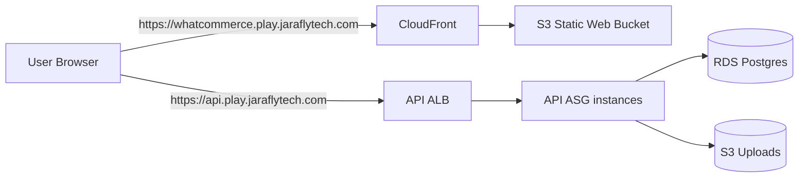
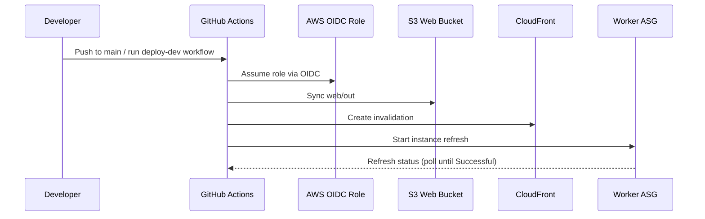
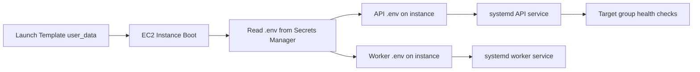

# Deployment Architecture (AWS)

This document describes how Whatcommerce is deployed in AWS for the `dev` environment.

## Network and compute topology

```mermaid
flowchart TB
  Internet((Internet))

  subgraph AWS[AWS Account / Region]
    subgraph VPC[VPC]
      subgraph PubA[Public Subnet A]
        ALB[Application Load Balancer]
      end
      subgraph PubB[Public Subnet B]
        ALB2[ALB AZ peer]
      end

      subgraph PrivA[Private Subnet A]
        API1[API EC2 Instance\n(ASG)]
        WRK1[Worker EC2 Instance\n(ASG)]
      end
      subgraph PrivB[Private Subnet B]
        API2[API EC2 Instance\n(ASG)]
        WRK2[Worker EC2 Instance\n(ASG)]
      end

      NAT[NAT Gateway]
    end

    RDS[(RDS PostgreSQL)]
    Uploads[(S3 Uploads Bucket)]
    WebBucket[(S3 Web Bucket)]
    CF[CloudFront Distribution]
    SM[Secrets Manager]
    ACM[ACM Certificate]
    R53[Route53 Hosted Zone]
  end

  Internet -->|HTTPS api.*| R53
  Internet -->|HTTPS whatcommerce.*| R53
  R53 --> CF
  R53 --> ALB
  CF --> WebBucket
  ALB --> API1
  ALB --> API2
  API1 --> RDS
  API2 --> RDS
  API1 --> Uploads
  API2 --> Uploads
  API1 --> SM
  API2 --> SM
  WRK1 --> SM
  WRK2 --> SM
  WRK1 --> API1
  WRK2 --> API2
  PrivA --> NAT
  PrivB --> NAT
  NAT --> Internet
  ACM --> ALB
  ACM --> CF
```

## Domain routing



## CI/CD and instance refresh flow



## Boot-time configuration flow



## Notes

- API instances are private and only reachable through the ALB security group.
- Worker instances are private and egress-only; they communicate outbound to WhatsApp/OpenAI/API.
- RDS is private and restricted to API security group access.
- CloudFront serves the static web app from S3 and handles edge caching.
- Secrets are injected at boot from Secrets Manager; runtime `.env` files are not stored in git.
